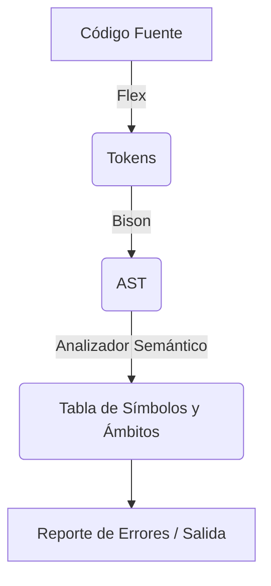

# Visión General y Arquitectura

**TL;DR:** Este es un compilador tradicional de múltiples pasadas escrito en C utilizando Flex y Bison. Parsea el código hacia un Árbol de Sintaxis Abstracta (AST) y luego realiza un análisis semántico (resolución de ámbitos, declaraciones de variables).

## Diagrama de Arquitectura

## Archivos Fuente Relevantes
| Archivo | Rol |
|---------|-----|
| `build.sh` | Orquestador de la construcción (build) |
| `src/bison.y` | Parseo principal y construcción del AST |
| `src/symbol_table.c` | Análisis Semántico |

## Conceptos Clave
| Concepto | Descripción | Origen |
|----------|-------------|--------|
| Múltiples Pasadas | Primero se parsea a AST, luego se ejecutan verificaciones semánticas | `src/bison.y:L198` |
| Nodos del AST | Árboles construidos durante las operaciones shift-reduce | `src/ast.c` |

## Áreas de Desarrollo Activo
- `src/ast.c` y `src/symbol_table.c` son actualmente áreas de alta actividad para agregar verificación de tipos y reglas semánticas.
