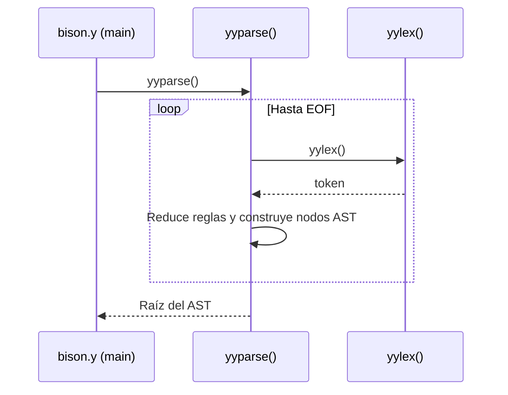

# Análisis Léxico y Sintáctico

**TL;DR:** La capa léxica es manejada por Flex (`lexer.l`), produciendo tokens. La capa sintáctica es manejada por Bison (`bison.y`), utilizando análisis LALR(1) para construir el AST.

## Diagrama de Arquitectura

## Archivos Fuente Relevantes
| Archivo | Descripción |
|---------|-------------|
| `src/lexer.l` | Definiciones de tokens, expresiones regulares para IDs, strings, etc. |
| `src/bison.y` | Reglas gramaticales, acciones shift/reduce, función `main`. |

## Detalles
El parser depende fuertemente de `newNode` y `newSymbol` durante las reglas de reducción (reduce) para construir incrementalmente el árbol. Tras un parseo exitoso, el puntero `raizAST` apunta a la raíz del AST (`src/bison.y:203`).
