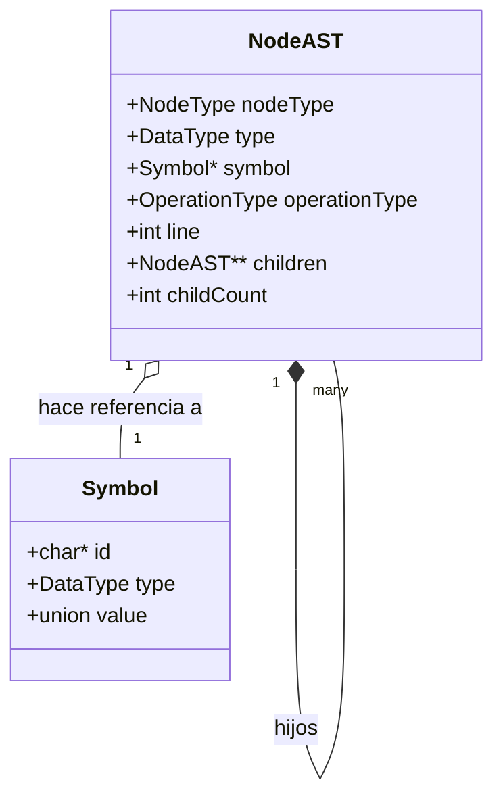

# Árbol de Sintaxis Abstracta (AST) y Tipología de Nodos

**TL;DR:** El Árbol de Sintaxis Abstracta (AST) representa la estructura sintáctica jerárquica del código fuente. El árbol se construye utilizando una estructura universal `NodeAST` cuyo comportamiento específico, mapeo de hijos y datos contenidos cambian radicalmente dependiendo de su `nodeType`.

## Diagrama de Arquitectura

## Archivos Fuente Relevantes

| Componente | Rol | Ubicación |
|------------|-----|-----------|
| `NodeType` | Enumeración de los 13 tipos de nodos. | `src/ast.h:L27-L41` |
| `NodeAST` | Definición de la estructura principal del árbol. | `src/ast.h:L44-L52` |
| Constructores | `newNode`, `newBinaryOperatorNode`, `newMethodDeclaration` | `src/ast.c:L38-L130` |

---

## Topología Detallada de Nodos

Cada nodo dentro del AST es una instancia de `NodeAST`, pero la forma en que se utilizan sus campos varía enormemente.

### Declaraciones e Identificadores

#### `VARIABLE_DECLARATION_NODE`
- **Propósito:** Representa la definición de una nueva variable (ej: `int x;`).
- **Hijos:** Ninguno (`childCount = 0`).
- **Carga (Payload):** El campo `symbol` apunta a un `Symbol` recién asignado que contiene el `id` y `type` de la variable.
- **Acción Semántica:** Se verifica contra el ámbito actual para evitar re-declaraciones.

#### `ID_NODE`
- **Propósito:** Representa el uso de una variable existente en una expresión (ej: `x + 1`).
- **Hijos:** Ninguno.
- **Carga:** El campo `symbol` guarda el nombre del identificador (`id`).
- **Acción Semántica:** Verificado por `lookupVariable` para asegurar que ha sido declarado en el ámbito actual o en los padres (`src/symbol_table.c:L109`).

#### `CONSTANT_NODE`
- **Propósito:** Representa valores literales (ej: `42`, `3.14`, `true`).
- **Hijos:** Ninguno.
- **Carga:** El campo `symbol` guarda el valor literal específico dentro de la `union` (`int_val`, `float_val`, etc.) pero tiene un `id` igual a `NULL`. Se crea a través de helpers como `newIntLiteralNode` (`src/ast.c:L170`).

### Operadores y Expresiones

#### `ASSIGNMENT_NODE`
- **Propósito:** Representa la asignación de un valor a una variable (ej: `x = 5;`).
- **Mapeo de Hijos:**
  - `children[0]`: `ID_NODE` representando la variable destino.
  - `children[1]`: La expresión siendo evaluada y asignada.
- **Carga:** Contiene el `symbol` de la variable destino para una rápida resolución de ámbito.
- **Nota:** El constructor sintáctico en `bison.y` exige exactamente esta posición para sus hijos.

#### `BINARYOPERATOR_NODE`
- **Propósito:** Operaciones lógicas y matemáticas (`+`, `-`, `&&`, `<`).
- **Mapeo de Hijos:**
  - `children[0]`: Operando izquierdo (`GET_LEFT(node)`).
  - `children[1]`: Operando derecho (`GET_RIGHT(node)`).
- **Carga:** El campo `operationType` dicta la operación específica (`OP_ADD`, `OP_MUL`, etc.) definida en `src/ast.h:L12`.

### Control de Flujo

#### `BLOCK_NODE`
- **Propósito:** Representa un bloque de código delimitado por llaves `{ ... }`.
- **Mapeo de Hijos:** `children[0...n]` almacena una cantidad arbitraria de nodos de sentencias.
- **Acción Semántica:** Obliga al analizador semántico a invocar `analyzeSemantics` de forma recursiva para generar un nuevo sub-ámbito (`Scope`) (`src/symbol_table.c:L85`).

#### `IF_ELSE_NODE`
- **Propósito:** Bifurcación condicional.
- **Mapeo de Hijos:** 
  - `children[0]`: Expresión condicional (`GET_CONDITION(node)`).
  - `children[1]`: Bloque `IF`.
  - `children[2]`: Bloque `ELSE` (Opcional, puede ser `NULL`).

#### `WHILE_NODE`
- **Propósito:** Estructura de bucle.
- **Mapeo de Hijos:**
  - `children[0]`: Expresión condicional.
  - `children[1]`: Cuerpo del bucle (generalmente un `BLOCK_NODE`).

### Métodos y Funciones

#### `METHOD_DECLARATION_NODE`
- **Propósito:** Define una nueva función.
- **Mapeo de Hijos:**
  - `children[0]`: El cuerpo del método (`BLOCK_NODE`).
- **Carga:** El campo `symbol` se utiliza intensamente aquí: almacena el tipo de retorno, el nombre de la función (`id`), y usa `symbol->parameters` para apuntar a un AST enlazado de parámetros.
- **Acción Semántica:** Crea un nuevo `Scope` durante el análisis semántico.

#### `METHOD_CALL_NODE`
- **Propósito:** Invoca una función previamente declarada.
- **Mapeo de Hijos:** `children[0...n]` representan los argumentos evaluados pasados a la función.
- **Carga:** El campo `symbol` guarda el nombre de la función llamada.

#### `PARAMETERS_NODE`
- **Propósito:** Un nodo de organización pura para almacenar definiciones de parámetros dentro del símbolo de un `METHOD_DECLARATION_NODE`.
- **Mapeo de Hijos:** `children[0...n]` almacenan los parámetros individuales `VARIABLE_DECLARATION_NODE`.

---

## Deuda Técnica y Limitaciones
- **`[NEEDS INVESTIGATION]` Desasignación de Nodos:** Aunque `freeSymbol` está implementado, parece faltar o estar incompleta una función `freeAST` recursiva para atravesar y liberar limpiamente todos los arrays de `NodeAST` y punteros de hijos asignados dinámicamente, lo cual podría provocar fugas de memoria (memory leaks) en compilaciones grandes.
