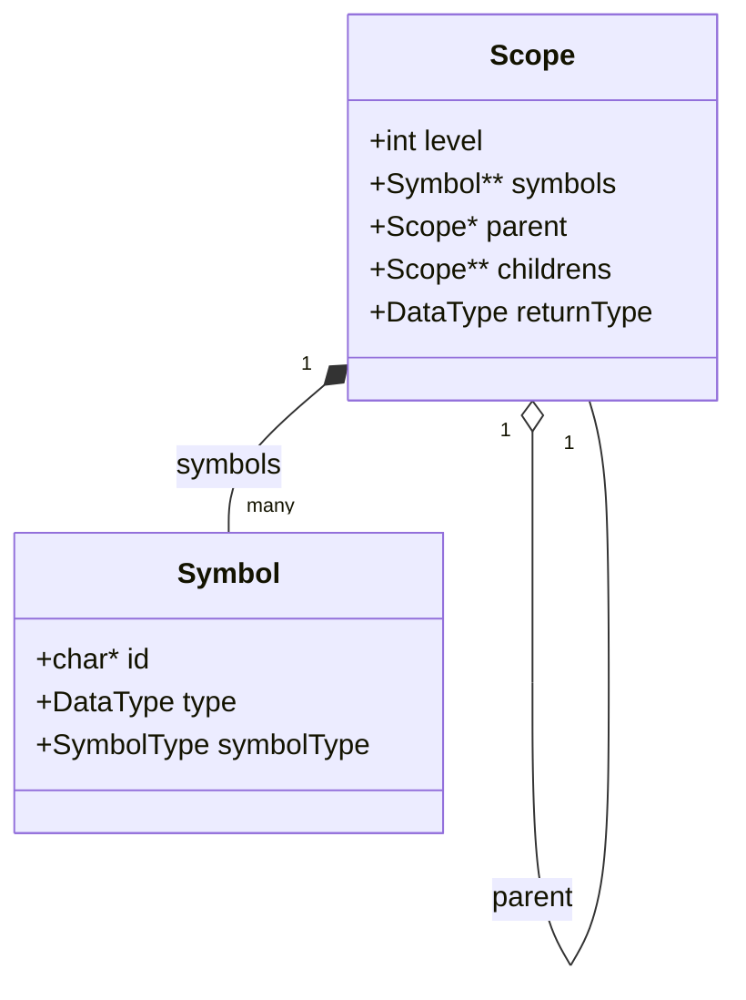

# Análisis Semántico, Ámbitos (Scopes) y Tabla de Símbolos

**TL;DR:** La fase semántica recorre el AST para poblar los Ámbitos (Scopes). Captura variables no declaradas, declaraciones múltiples, y vincula identificadores a estructuras `Symbol` dentro de una jerarquía de árbol de `Scope`s. Aquí se define qué se guarda, qué se ignora y cómo fluye la información.

## Diagrama de Arquitectura

## Archivos Fuente Relevantes
| Archivo | Descripción |
|---------|-------------|
| `src/symbol_table.h` | Estructuras `Scope` y `Symbol`. |
| `src/symbol_table.c` | Lógica de creación de scopes, inserción y búsqueda de variables. |

---

## Anatomía de un Ámbito (`Scope`)

Un `Scope` representa un bloque léxico aislado en el código (como el cuerpo de una función o un bloque dentro de un `if`/`while`). 

### ¿Qué se guarda en la Tabla de Símbolos (`symbols`)?
La tabla de símbolos de un ámbito (`scope->symbols`) **SOLO** almacena entidades que tienen nombre o representación explícita y necesitan ser recordadas:
1. **Variables Locales:** Originadas por un `VARIABLE_DECLARATION_NODE`. Entran a la tabla para evitar que otra variable use el mismo nombre en este mismo nivel, y para permitir que código dentro o más abajo de este ámbito las pueda leer/escribir.
2. **Parámetros de Métodos:** Se guardan como variables dentro del ámbito exclusivo del método para que puedan ser usados en su cuerpo.
3. **Declaraciones de Métodos:** El nombre del método y su firma se guardan en el ámbito *padre* (usualmente el global) para que otros métodos puedan invocarlo.

### ¿Qué se IGNORA y NO entra a la Tabla de Símbolos?
No todos los nodos del AST generan un `Symbol` dentro del `Scope`. Se ignoran de la tabla:
1. **Palabras Clave y Operadores:** Nodos como `BINARYOPERATOR_NODE`, `IF_ELSE_NODE`, `WHILE_NODE` **no** se insertan en la tabla de símbolos. Solo dictan el flujo.
2. **Asignaciones e Identificadores Simples:** Un `ASSIGNMENT_NODE` o un `ID_NODE` no *crea* un símbolo en el scope. Lo que hacen es *buscar* (`lookupVariable`) si el símbolo ya fue guardado previamente.
3. **Bloques (`BLOCK_NODE`):** No se guardan como símbolos. En su lugar, generan un nuevo `Scope` hijo, pero el bloque en sí no tiene un nombre guardado en la tabla de su padre.

---

## Dinámica de Ámbitos (Scope Chaining)

El compilador maneja la visibilidad de variables usando punteros `parent` y `childrens`.

### 1. Creación de un Nuevo Ámbito
Cada vez que `analyzeNodeSemantics` se cruza con un `BLOCK_NODE` o un `METHOD_DECLARATION_NODE`, invoca a `analyzeSemantics()` para instanciar un nuevo `Scope`.
- `level` aumenta en +1 respecto al padre.
- `returnType` se propaga si es un método (para validar los `return`), o `NULL` si es un bloque normal.
- El nuevo scope se inserta en el array `childrens` del padre.

### 2. Sombreado y Prevención de Colisiones (Shadowing)
Cuando declaramos una variable (`VARIABLE_DECLARATION_NODE`), el compilador usa **`lookupVariableCurrentScope`**:
- Revisa **únicamente** el array `symbols` del `Scope` exacto donde estamos parados.
- Si el identificador existe $\rightarrow$ **Error: Variable ya declarada.**
- Si no existe $\rightarrow$ Se inserta.
- *Nota:* Si existe una variable con el mismo nombre en el `parent`, no dará error. Esto permite el "Shadowing" (variables locales ocultando a las globales).

### 3. Resolución de Variables (Uso y Asignación)
Cuando leemos (`ID_NODE`) o escribimos (`ASSIGNMENT_NODE`) una variable, el compilador usa **`lookupVariable`**:
- Busca primero en el `Scope` actual.
- Si no lo encuentra, viaja al `scope->parent` y busca ahí.
- Repite recursivamente hasta llegar al Scope Global (`level 0`).
- Si llega al final y retorna `NULL` $\rightarrow$ **Error: Variable no declarada.**

---

